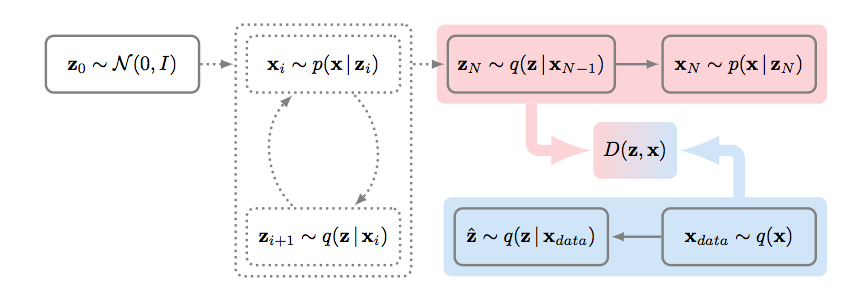

# GibbsNet

PyTorch implementation of [GibbsNet: Iterative Adversarial Inference for Deep Graphical Models](https://arxiv.org/abs/1712.04120).

## Requirements

- Python 3
- Pytorch
- visdom

## Usage

SVHN, CIFAR10 dataset are currently supported.

### Train

    $ python train.py --model=GibbsNet --batch_size=100 --lr=1e-5 --dataset=SVHN --sampling_count=20
    $ python train.py --model=GibbsNet --batch_size=100 --lr=1e-5 --dataset=SVHN --gpu_ids=0,1 --sampling_count=20

### Visualize

- To visualize intermediate results and loss plots, run `python -m visdom.server` and go to the URL http://localhost:8097

### Test
    $ python test.py --test_count=20 --model=GibbsNet --repeat_generation=10
- Test result will generate in `./[opt.test_dir]/[opt.model/`, of which default value is `./test/GibbsNet/`
- Test result consists of `real_[i].png` files and `fake_[i]_[j].png` files. `real_[i].png` files are sampled from real dataset, and `fake_[i]_[j].png` files are generated from sampled latent variable of `real_[i].png`

## Results

### 1. SVHN

- Working in Progress

## Implementation detail
- Original implementation of discriminator network for CIFAR10 dataset uses maxout activation layer, but this implementation uses leaky ReLU rather than maxout layer because of lack of GPU memory.
- all hyper parameters references to paper [Adversarially Learned Inference](https://arxiv.org/abs/1606.00704).
- To train GibbsNet, appropriate learning rate is `1e-5` for sampling count 20. You can increase learning rate when you sample less than 20 times.

## TODOs
- Custom dataset support
- Visualize test results

## Code reference

Visualization code(visualizer.py, utils.py) references to pytorch-CycleGAN-and-pix2pix(https://github.com/junyanz/pytorch-CycleGAN-and-pix2pix) by [Jun-Yan Zhu](https://github.com/junyanz)

## Author

[Tony Kim](https://github.com/wlwkgus)